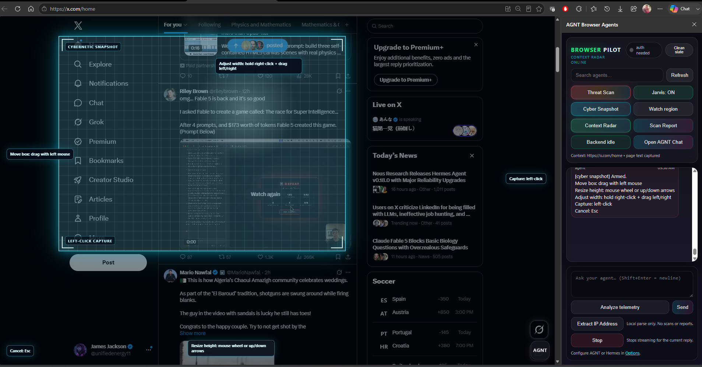
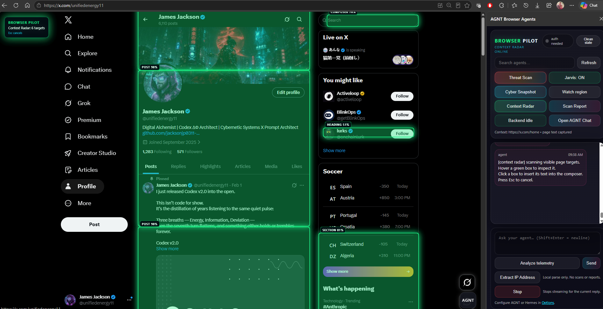
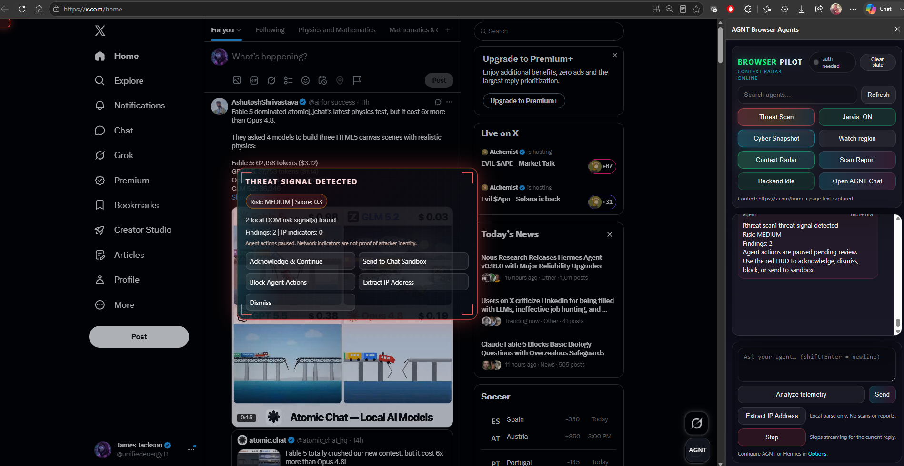

# BrowserPilot 🧭

**Copilot is not enough for a browser. You have to let agents in — *but* keep the execution path inspectable.**

BrowserPilot is a **local-first browser-agent bridge** for **AGNT** and **Hermes Agent**:

- A side panel in **Edge** and **Chrome**
- Captures **bounded page context** (URL, title, selection, capped text)
- Chats with your AGNT agent (**`Edge Tab Operator`**) or Hermes through its API Server adapter
- Executes explicit, auditable tab commands via a single protocol line:

```text
AGNT_EXEC: [{"kind":"navigate","url":"https://example.com"},{"kind":"click","css":"button#login"}]
```

## ✨ New: Edge Copilot (AGNT + SymTorch) 🛡️🧠

BrowserPilot now supports a **3‑state control mode**:

1) **Control: OFF** — chat only, no tab actions
2) **Jarvis: ON** — executes `AGNT_EXEC` commands
3) **Edge Copilot: ON** — executes `AGNT_EXEC` **only after SymTorch policy evaluation**

That means:

> **Agent proposes commands → SymTorch evaluates risk → BrowserPilot executes (or blocks) → traceable result**

The repo includes:

- ✅ **SymTorch AGNT plugin** (vendored): `agnt-plugins/symtorch-toolkit/`
- ✅ **Default policy bundle**: `symtorch/policies/browserpilot-default.policy.json`

> Option (1) implemented: BrowserPilot vendors the **AGNT SymTorch toolkit plugin + policy bundles**. SymTorch itself remains a separate repo (recommended).

---

## Silent AGNT Integration 🤫

**BrowserPilot runs entirely in the side panel. No new browser tabs will open.**

- Chat and agent responses appear directly in the side panel
- Commands execute in the current tab
- AGNT telemetry is logged locally for debugging

This is intentional: BrowserPilot is designed to be a **non-intrusive browser operator** that works in-context, not a separate browser automation window.

---

## Cyber Snapshot



Cyber Snapshot is the user-controlled capture surface: the agent cannot silently choose the region. The operator positions the ice-blue overlay, captures visible text, and can optionally attach the viewport crop to the side-panel context.

Cyber Snapshot lets the user manually select a visible page region with an ice-blue overlay and insert extracted text into the BrowserPilot side-panel composer.
This implementation was transferred from the working `agnt-evo/browser-agents-edge-extension` Cyber Snapshot implementation.

Current capability:
- Manual user-triggered region capture
- Cybernetic ice-blue overlay
- DOM text extraction inside selected viewport rectangle
- Plain text insertion into the side-panel composer
- Optional viewport crop preview if available from the transferred implementation

Not yet included unless already present in the source implementation:
- OCR fallback
- Semantic element anchoring
- Autonomous capture

---

## Context Radar



Context Radar is the page-understanding surface: it highlights likely readable/actionable regions so the human can choose what enters context instead of letting the agent scrape blindly.

Context Radar adds a manual, DOM-first HUD that scans the visible page for likely context targets and draws glowing green boxes over readable items such as posts, tables, forms, code blocks, status panels, and composers.

Current capability:
- Manual user-triggered scan from the side panel
- Semi-transparent Browser Pilot HUD
- Green target boxes with hover previews and action buttons
- Capture target text into the composer
- Watch a selected target region for visible text changes
- Mark a target as the current working target
- Ignore repeated low-value target types locally
- Persistent local Radar preference memory
- Semantic selector hints: CSS path, role, aria-label, nearby heading, and text hash
- Structured target metadata for agent context
- No auto-send and no autonomous page action

Quick QA page:

```text
test-pages/context-radar-qa.html
```

---

## Threat Scan / Threat Radar



Threat Radar is the safety surface: it pauses risky browser actions when local DOM signals look suspicious, shows the exact review HUD to the user, and keeps IP indicators framed as evidence rather than attribution.

Threat Scan is a local-first DOM threat scan for the active tab. It replaces the visible Capture Page control as the primary safety action.

Current capability:
- Local DOM-first scan with no API call by default
- Red centered Threat HUD only when medium/high local risk signals are found
- Detects hidden prompt-like text, suspicious overlays, link mismatch, suspicious iframes, credential forms, inline handlers, and embedded IP indicators
- Scanner does not execute untrusted page JavaScript
- Scanner does not fetch suspicious URLs
- Scanner does not prove malware
- Scanner does not auto-send raw page data to AGNT

Threat Lock gates risky agent actions when a high-risk report is active. Safe observation commands such as wait, screenshot, DOM audit, Threat Scan, Context Radar, Cyber Snapshot, Extract IP, and export/report actions remain allowed.

## Threat Review Sandbox

Threat Review is human-approved. BrowserPilot inserts a redacted review prompt into the composer only after the user clicks Send to Chat Sandbox.

The repo includes a static runner:

```powershell
python sandbox/threat-review/threat_review_runner.py .\approved-threat-review-request.json
```

Security model:
- Container/disposable worker isolation is preferred
- Python VENV is dependency/runtime containment only, not a full security boundary
- Static analysis only
- No suspicious URL fetching by default
- No page JavaScript execution
- Raw evidence is not retained by default
- Final report includes a wipe certificate based on directory deletion verification
- Rule candidates are suggestions only and are not installed automatically

## Extract IP Address

The small bottom Extract IP Address button parses IPv4/IPv6 indicators from composer text, Cyber Snapshot text, page context, the latest Threat Scan report, and the latest Context Radar target.

It supports multiple IPs, deduplicates indicators, and classifies public/private/reserved/documentation/loopback/link-local/multicast addresses. This is local-only parsing. It does not ping, scan, enrich, attack, report, or attribute.

IP addresses are network indicators only. They are not proof of attacker identity and may belong to CDNs, cloud providers, shared hosts, proxies, VPNs, or compromised infrastructure.

## Network IOC Capture / Authority Report Package

Network IOC Capture is optional and gated. BrowserPilot v0.3.4 generates local IOC/evidence packages only after a user-reviewed suspicious or likely threat flow.

Threat Screens in v0.3.4 add an optional evidence HUD next to the red Threat Radar decision HUD. Each screen shows the local finding category, risk/severity, redacted preview, element hints, local IP indicators when present, and a focus action for the source rectangle. The Threat Timeline adds scan chronology and severity filters so high/medium/low findings can be reviewed without losing the full local evidence context.

The Authority Report Package can include domains, URLs, extracted IP indicators, observed request IPs only if a future optional permission is enabled, redirect chains and timestamps when available, and the sandbox wipe certificate.

BrowserPilot does not auto-submit reports, publicly post IP addresses, accuse an IP owner of being an attacker, attack, scan, retaliate, or dox.

Allowed actions are local/export-oriented: create authority report, export IOC bundle, copy an abuse report template, or manually open an official reporting page after the user clicks.

---

## New AGNT user checklist ✅ (distribution confidence)

Use this when someone installs BrowserPilot on a fresh machine.

1. **Run AGNT** (default: `http://localhost:3333`).
2. **Install SymTorch toolkit into AGNT** (Edge Copilot mode):

   Copy:

   ```text
   BrowserPilot/agnt-plugins/symtorch-toolkit
   →
   <agnt-evo>\backend\plugins\dev\symtorch-toolkit
   ```

   Then in AGNT:
   - restart AGNT, or
   - `POST /api/plugins/reload`

3. **Verify SymTorch tools are visible** (quick check):

   - Open AGNT → Workflows → tools list, or
   - run BrowserPilot smoke test: `npm run smoke:edgecopilot`

4. **Get token from AGNT UI**:

   In DevTools Console:

   ```js
   localStorage.getItem("token")
   ```

5. **Configure BrowserPilot Options**:
   - paste Base URL + token
   - click **Test connection** → **Save**

6. **Load the extension**:
   - Edge: `edge://extensions` → Load unpacked → `apps\edge-extension`
   - Chrome: `chrome://extensions` → Load unpacked → `apps\chrome-extension`

7. **Mint test**:
   - open any page → click floating **AGNT**
   - toggle **Edge Copilot: ON**
   - ask: “scroll down 600px” (should allow)
   - ask: “close this tab” (should block or require low-risk alternative)

---

## Quickstart ⚡

### 0) Requirements

- Edge or Chrome
- A running **AGNT** instance (default: `http://localhost:3333`)
- An AGNT bearer token

Optional:

- A running **Hermes Agent API Server** (default: `http://localhost:8642`)
- Hermes `API_SERVER_KEY`

### 1) Start AGNT

```powershell
npm start
```

### 2) Install the SymTorch toolkit into AGNT (for Edge Copilot)

BrowserPilot vendors the plugin here:

```text
agnt-plugins/symtorch-toolkit/
```

Install it into your AGNT instance by copying it into:

```text
<agnt-evo>\backend\plugins\dev\symtorch-toolkit
```

…then reload plugins in AGNT.

> If the SymTorch toolkit is not installed in AGNT, **Edge Copilot mode will block** (fail-closed) so policy can’t be bypassed silently.

### 3) Load the extension (Edge)

1. Open `edge://extensions`
2. Enable **Developer mode**
3. **Load unpacked** → select:

```text
apps\edge-extension
```

### 4) Load the extension (Chrome)

1. Open `chrome://extensions`
2. Enable **Developer mode**
3. **Load unpacked** → select:

```text
apps\chrome-extension
```

### 5) Configure BrowserPilot (token + operator)

1. In **AGNT**, open your web UI (e.g. `http://localhost:3333/chat`).
2. Open DevTools Console and run:

```js
localStorage.getItem("token")
```

3. Copy the token.
4. Open the extension’s **Options** page:
   - Edge: `edge://extensions` → **BrowserPilot for Edge** → **Details** → **Extension options**
   - Chrome: `chrome://extensions` → **BrowserPilot for Chrome** → **Details** → **Extension options**
5. Set:
   - **AGNT Base URL** (usually `http://localhost:3333`)
   - **AGNT token** (paste)
6. Click **Test connection** → **Save**.

On first run, BrowserPilot automatically creates/selects the AGNT agent named **`Edge Tab Operator`** (the operator).

### 6) Configure Hermes instead of AGNT

BrowserPilot can also use Hermes Agent directly:

1. Start Hermes with its API Server enabled.
2. Open BrowserPilot **Options**.
3. Set **Agent Backend** to **Hermes Agent**.
4. Set **Hermes API Server URL** to `http://localhost:8642`.
5. Paste the Hermes `API_SERVER_KEY`.
6. Click **Test connection** -> **Save**.

Hermes mode talks to `/v1/chat/completions` and uses `X-Hermes-Session-Key` so the BrowserPilot side-panel conversation stays in one Hermes session across restarts.

See [docs/hermes-adapter.md](docs/hermes-adapter.md).

---

## Repo layout 🗺️

```text
browser-pilot/
  apps/
    edge-extension/            MV3 Edge side panel adapter
    chrome-extension/          MV3 Chrome side panel adapter
  extension/                   Legacy adapter kept for backwards compatibility

  agnt-plugins/
    symtorch-toolkit/          Vendored AGNT plugin: symtorch-rule-evaluate + symtorch-policy-bundle-evaluate

  symtorch/
    policies/                  Versioned policy bundles (symtorch.policyBundle.v1)

  docs/                        Protocol + architecture + security
  rcc/                         RCC Nexus route and mini README surface
  reports/rcc_nexus/           Optional RCC evidence reports
  scripts/                     packaging + validation + icon gen
  dist/                        prebuilt zip artifacts
```

---

## Architecture (one-glance) 🔭

```text
┌───────────────────────────┐
│  You (Edge/Chrome tab)     │
└─────────────┬─────────────┘
              │ (bounded context)
              ▼
┌───────────────────────────┐
│ BrowserPilot Side Panel    │
│  - chat + mode toggle      │
│  - parses AGNT_EXEC JSON   │
└─────────────┬─────────────┘
              │ POST /api/agents/:id/chat
              ▼
┌───────────────────────────┐
│ AGNT Agent: Edge Tab Op    │
└─────────────┬─────────────┘
              │ emits AGNT_EXEC
              ▼
┌───────────────────────────┐
│ (Edge Copilot ON)          │
│ SymTorch policy evaluation │
│ via AGNT tool endpoint     │
└─────────────┬─────────────┘
              │ allow / block
              ▼
┌───────────────────────────┐
│ Extension executes command │
│  - background.js           │
│  - contentScript.js        │
└───────────────────────────┘
```

---

## Packaging 📦

```powershell
npm run validate
npm run validate:rcc
npm run icons:gen
npm run package:all
# or individually:
# npm run package:edge
# npm run package:chrome
# npm run package:legacy
```

Outputs:

```text
dist\browser-pilot-edge-extension.zip
dist\browser-pilot-chrome-extension.zip
```

---

## Notes on safety 🔒

BrowserPilot is powerful:

- It has broad host permissions so it can operate on arbitrary user-selected pages.
- The control path is **explicit** (`AGNT_EXEC`) and bounded by implemented commands.
- **Edge Copilot** adds an additional guardrail: **policy evaluation**.

See: `docs/security-model.md`.

---

# PART I - Human README

## Human Director Box

BrowserPilot is the human-facing browser-agent cockpit. Keep the top of this README readable for operators first: what it does, how to install it, what the buttons mean, what it will not do, and how to validate it.

Current human route:

1. Install the Edge or Chrome extension from `apps/edge-extension` or `apps/chrome-extension`.
2. Configure AGNT or Hermes in Options.
3. Use the side panel for chat, Threat Scan, Cyber Snapshot, Context Radar, Scan Report, Extract IP Address, and AGNT Chat.
4. Treat Threat Scan findings as local risk signals, not malware proof.
5. Treat extracted IPs as indicators, not attacker identity.

Human-first boundary:

- The agent may propose browser work, but the operator owns capture, reporting, risky actions, and release claims.
- BrowserPilot is powerful local software. It should stay explicit, inspectable, and bounded.

# PART II - RCC Nexus README

## RCC Nexus Identity

BrowserPilot includes a lightweight RCC Nexus layer adapted from the Observable Manifold Network pattern.

RCC tells the agent what the repository means.
RCC Nexus tells the agent where it is.
Validation tells the agent whether reality agreed.

Primary Nexus files:

- [`docs/rcc-nexus.md`](docs/rcc-nexus.md)
- [`rcc/README.md`](rcc/README.md)
- [`rcc/nexus/README.md`](rcc/nexus/README.md)
- [`rcc/nexus/route_map.json`](rcc/nexus/route_map.json)

Nexus route:

```text
Human README -> RCC Nexus README -> AI Agent README -> route map -> Echo Location -> validation
```

Nexus validation:

```powershell
npm run validate:rcc
```

Nexus non-claim lock:

- Navigation is not validation.
- Documentation is not correctness.
- Route maps are not runtime proof.
- Context reconstruction is not code quality.
- Threat signals are not malware proof.
- IP indicators are not attacker identity.

# PART III - AI Agent README

## AI Operating Contract

AI agents working in BrowserPilot should use this read order:

1. `README.md`
2. `README_90_SECONDS.md`
3. `docs/README.md`
4. `docs/rcc-nexus.md`
5. `docs/rehydration-protocol.md`
6. `docs/failure-modes.md`
7. `rcc/nexus/route_map.json`
8. The mini README inside the folder being edited

AI routing guide:

| Work area | Start here | Validation |
| --- | --- | --- |
| Edge runtime | `apps/edge-extension/README.md` | `npm run validate` |
| Chrome runtime | `apps/chrome-extension/README.md` | `npm run validate` |
| Shared docs/safety | `docs/README.md` | `npm run validate:rcc` |
| Packaging/scripts | `scripts/README.md` | relevant `npm run package:*` |
| RCC route changes | `rcc/nexus/README.md` | `npm run validate:rcc` |
| Sandbox review | `sandbox/README.md` | static runner smoke test when changed |

AI completion rule:

- Do not claim done without validation output.
- Do not edit one browser adapter and forget parity unless divergence is intentional.
- Do not promote documentation claims beyond implemented code.

# PART IV - Rehydration Protocol

## BrowserPilot Rehydration

Rehydration is the resume protocol for stale sessions, cross-repo syncs, extension reload failures, and release claims.

```text
anchor -> load repo origin -> measure drift -> rehydrate -> validate -> compound
```

Primary protocol file:

- [`docs/rehydration-protocol.md`](docs/rehydration-protocol.md)

Failure-mode map:

- [`docs/failure-modes.md`](docs/failure-modes.md)

Compounding gate:

- No origin alignment, no durable mutation.
- No validation, no completion claim.
- No extension reload or manual runtime check, no browser-runtime certainty claim.

---

## Roadmap 🌌

- Confirm/Authorize flows for medium-risk actions
- Token broker (replace long-lived pasted tokens)
- Better trace export → `symtorch.decisionTraceSnapshot.v1` log + AGNT execution linking
- DOM stability helpers (site layout changes)

---

Free Your Agents. Let them in The Web. 


### Troubleshooting

- **Edge Copilot blocks everything immediately**: ensure the SymTorch toolkit plugin is installed into AGNT and AGNT was restarted. Then run `npm run smoke:edgecopilot`.
- **SymTorch admission failed**: BrowserPilot defaults to `runAdmission: false` for local installs. Only enable admission when SymTorch secrets are configured.
